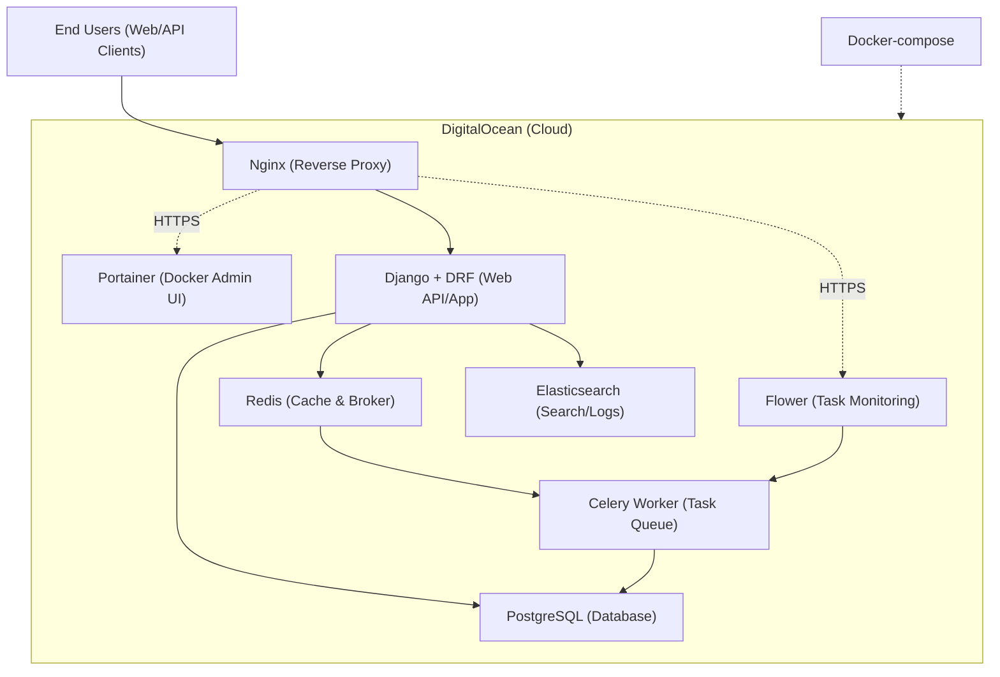

# Mentoreed

<!-- Still missing some definitions about static files and video provider (prob going to use cloudflare stream)
 -->

<!-- App might look something like this
 -->

## How to run
- Clone the repository
- Make sure you have [docker compose](https://docs.docker.com/compose/) and [make](https://www.gnu.org/software/make/#download) installed
- Inside the root folder:

```bash
docker compose -f local.yml build
docker compose -f local.yml up
```

## Application Stack

### Backend
- **Django & Django REST Framework**: Web framework and API layer.
- **PostgreSQL**: Relational database for persistent data storage.
- **Redis**: In-memory data store for caching and task brokering.
- **Celery & Flower**: Distributed task queue and real-time task monitoring.

### DevOps & Infrastructure
- **Docker**: Containerization for development and deployment.
- **Nginx**: Reverse proxy and static file server.
- **Portainer**: Container management.
- **DigitalOcean**: Cloud hosting and infrastructure provider.

### Roadmap
- **Observability**: Integrated metrics and logging for better visibility.
- **Stack Tracing**: Improved error monitoring and debugging.
- **CI/CD**: Automated testing, deployments, and migration health checks.

### Current architecture


